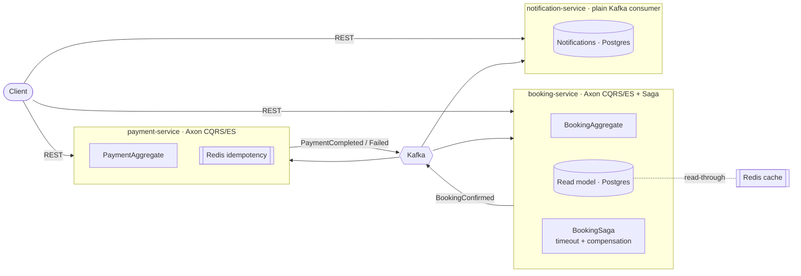

# Tickera — Event-Driven Ticket Booking (Axon · Kafka · CQRS/ES)

A public, production-shaped microservices system that books event tickets. It is
built to demonstrate the distributed-systems patterns I work with day to day:
**CQRS + event sourcing with Axon inside each service**, **Kafka as the
integration backbone between services**, a **Saga** for cross-service
orchestration with timeout/compensation, **Redis** for exactly-once idempotency
and read caching, and **consumer-driven contract testing (Pact) on an
asynchronous Kafka boundary**.

> One command to run everything: `docker compose up --build` → then `make demo`.

[](.github/workflows/ci.yml)


---

## Why this exists

Most portfolios show CRUD over REST. This one shows the harder, more senior parts:
event sourcing, sagas, eventual consistency, idempotency under at-least-once
delivery, and contract testing on message boundaries — with the reasoning
written down as [Architecture Decision Records](docs/adr) and a
[low-level design doc](docs/LLD-booking-service.md), the way I document systems at
work.

## Architecture at a glance



Full diagrams (command→event→projection, saga sequence) are in
[`docs/architecture.md`](docs/architecture.md).

### The happy path, in one sentence

`POST /bookings` → `confirm` emits **BookingConfirmed** to Kafka → payment-service
charges (idempotently) and emits **PaymentCompleted** → the booking saga marks the
booking **PAID**; if payment never lands, the saga's **deadline** compensates by
cancelling. notification-service records a customer notification at each step.

## Services

| Service | Port | Stack highlights | Swagger |
|---------|------|------------------|---------|
| `booking-service` | 8081 | Axon aggregate + projection + **saga**, Kafka pub/sub, Redis cache | http://localhost:8081/swagger-ui.html |
| `payment-service` | 8082 | Axon aggregate, **Redis idempotency**, Kafka pub/sub | http://localhost:8082/swagger-ui.html |
| `notification-service` | 8083 | **Non-Axon** Spring Kafka consumer, Postgres | http://localhost:8083/swagger-ui.html |
| `common-events` | — | Shared Kafka integration-event contracts | — |

Infra: Kafka + Zookeeper, Redis, one Postgres **per service**, Prometheus (`:9090`),
Grafana (`:3000`, anonymous viewer enabled).

## Quick start

Prerequisites: **Docker** (with Compose). JDK/Maven are *not* required to run —
the images build inside Docker. To build/test locally you need JDK 17 (the bundled
`./mvnw` fetches Maven itself).

```bash
# 1. Bring up the whole system (Kafka, Redis, 3x Postgres, 3 services, Prom+Grafana)
docker compose up --build

# 2. In another terminal, drive the end-to-end flow
make demo         # or: ./scripts/demo.sh
```

`make demo` creates a booking, confirms it, polls until the saga settles it to
`PAID`, then prints the resulting payment and notifications.

### Try it by hand

```bash
# create
BID=$(curl -s -X POST localhost:8081/api/v1/bookings -H 'Content-Type: application/json' \
  -d '{"customerId":"cust-42","eventName":"Symphony Gala","seats":3,"amount":240.00,"currency":"USD"}' \
  | python3 -c 'import sys,json;print(json.load(sys.stdin)["bookingId"])')

# confirm (starts the saga + publishes to Kafka)
curl -s -X POST localhost:8081/api/v1/bookings/$BID/confirm >/dev/null

# watch it become PAID
curl -s localhost:8081/api/v1/bookings/$BID | python3 -m json.tool
curl -s "localhost:8082/api/v1/payments?bookingId=$BID" | python3 -m json.tool
curl -s "localhost:8083/api/v1/notifications?bookingId=$BID" | python3 -m json.tool
```

> Tip: an amount above `1000.00` is declined by payment-service — a clean way to
> see the **failure/compensation** path drive the booking to `CANCELLED`.

## Testing strategy

| Layer | What it proves | Where |
|-------|----------------|-------|
| **Unit (aggregate)** | Invariants + transitions via Axon given/when/then, no infra | `BookingAggregateTest`, `PaymentAggregateTest` |
| **Contract (Pact, message)** | booking↔payment agree on the `BookingConfirmed` Kafka message | consumer: `BookingEventsConsumerPactTest` · provider: `BookingEventsProviderPactTest` |
| **Integration (Testcontainers)** | Real Kafka + Postgres: command→event→projection and the event actually reaches Kafka | `BookingFlowIntegrationTest` |
| **Unit (listener)** | notification mapping | `NotificationListenerTest` |

```bash
./mvnw test          # everything (Testcontainers needs Docker running)
make pacts           # generate the consumer pact, then verify it on the provider
```

The Pact flow is the message-based (async) flavour of consumer-driven contract
testing — the consumer writes its expectation to the shared [`/pacts`](pacts)
folder and the provider must satisfy it, so the two services can evolve
independently without a shared integration environment.

## Observability

- Each service exposes `/actuator/health`, `/actuator/prometheus`, `/actuator/metrics`.
- Prometheus scrapes all three; Grafana auto-provisions a **Tickera Overview**
  dashboard (request rate, p95 latency, JVM heap, Kafka consumption).
- Grafana: http://localhost:3000 · Prometheus: http://localhost:9090

## Design docs

- [Architecture & diagrams](docs/architecture.md)
- [Low-level design — booking-service](docs/LLD-booking-service.md)
- ADRs: [Axon vs plain Kafka](docs/adr/0001-axon-over-plain-kafka.md) ·
  [Database per service](docs/adr/0002-database-per-service.md) ·
  [Idempotency](docs/adr/0003-idempotency-strategy.md) ·
  [Eventual consistency & sagas](docs/adr/0004-eventual-consistency-and-sagas.md)

## Repository layout

```
tickera/
├── common-events/          # shared Kafka integration-event contracts
├── booking-service/        # Axon CQRS/ES + saga (the core)
├── payment-service/        # Axon CQRS/ES + Redis idempotency
├── notification-service/   # plain Spring Kafka consumer
├── docs/                   # architecture, LLD, ADRs
├── infra/                  # prometheus + grafana provisioning
├── pacts/                  # generated consumer contracts (shared)
├── scripts/demo.sh         # end-to-end demo
├── docker-compose.yml      # one-command stack
└── .github/workflows/ci.yml
```

## Roadmap (how it was built)

Built incrementally to keep a real commit history rather than one big dump:

1. Scaffold `booking-service`: CRUD + OpenAPI + Dockerfile + CI skeleton.
2. Axon command/event handling for the booking lifecycle.
3. `payment-service` + Kafka event between the two.
4. Pact contract tests + Testcontainers integration test.
5. Redis idempotency layer + observability dashboard.
6. README, architecture diagram, design docs, demo.

### Known gaps / next steps
- Flyway/Liquibase migrations instead of `ddl-auto=update`.
- `QuartzDeadlineManager` for durable, multi-instance saga deadlines.
- Dead-letter topics + retry policy on Kafka consumers.
- Aggregate snapshotting for long event streams.

## License

MIT — see [LICENSE](LICENSE).
