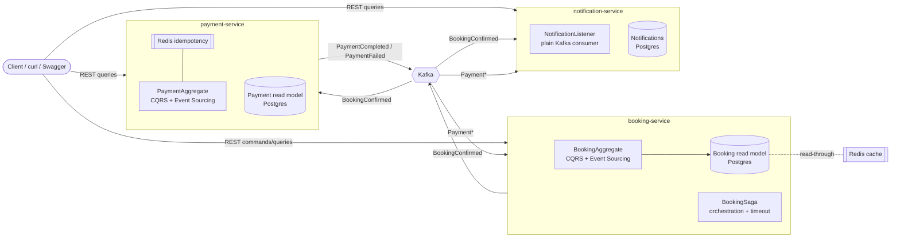
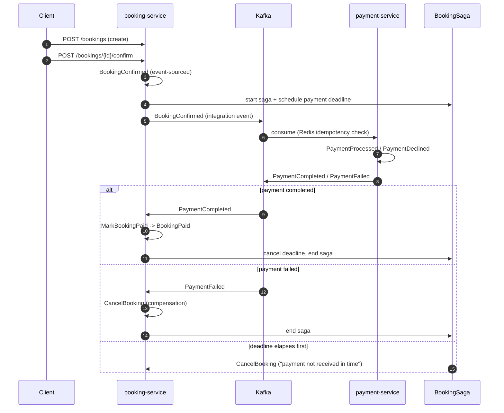

# Tickera — Architecture

Tickera is a small but production-shaped event-driven system for booking event
tickets. It exists to demonstrate **CQRS + event sourcing (Axon)** inside each
service, **Kafka** as the integration backbone between services, a **Saga** for
cross-service orchestration, **Redis** for idempotency and read caching, and
**consumer-driven contract testing (Pact)** on an asynchronous (message) boundary.

## 1. Context



Each service owns its database (**database-per-service**). Nothing shares tables;
the only coupling between services is the versioned integration-event contract in
the `common-events` module.

## 2. The write path: command → event → projection

This is the core CQRS/ES loop, identical in both `booking-service` and
`payment-service`:

```mermaid
flowchart LR
    cmd[Command<br/>e.g. ConfirmBooking] --> ch{Aggregate<br/>@CommandHandler}
    ch -->|validates invariant| ev[Event<br/>BookingConfirmed]
    ev --> store[(Event Store<br/>append-only)]
    store --> esh[@EventSourcingHandler<br/>rebuilds aggregate state]
    store --> proj[@EventHandler<br/>updates read model]
    proj --> rm[(Query DB)]
    store --> pub[@EventHandler<br/>publish integration event to Kafka]
```

- **Commands** express intent and are validated against current state.
- **Events** are immutable facts, appended to the event store — the source of truth.
- The aggregate is rebuilt by **replaying** its events, not by loading a row.
- **Projections** subscribe to the same events to build query-optimised read models.
- A separate handler translates the internal domain event into the **public
  integration event** and publishes it to Kafka.

## 3. The cross-service flow: the booking saga

The `BookingSaga` orchestrates booking → payment and, crucially, owns the
**timeout** — the failure mode a naive chain of listeners usually forgets.



## 4. Why these choices

Short version (full rationale in the ADRs under [`docs/adr`](adr)):

| Decision | Why | ADR |
|----------|-----|-----|
| Axon (CQRS/ES) *inside* a service, Kafka *between* services | Right tool per scope: Axon gives an audit-grade event store, aggregates and sagas; Kafka gives durable, replayable inter-service transport | [0001](adr/0001-axon-over-plain-kafka.md) |
| Database-per-service | Independent schema evolution and failure isolation; services couple only on event contracts | [0002](adr/0002-database-per-service.md) |
| Redis `SETNX` idempotency on inbound events | Kafka is at-least-once; a redelivered `BookingConfirmed` must not double-charge | [0003](adr/0003-idempotency-strategy.md) |
| Saga-owned timeout + compensation | Eventual consistency needs an explicit owner for "what if the reply never comes" | [0004](adr/0004-eventual-consistency-and-sagas.md) |

## 5. Technology map

| Concern | Technology |
|---------|-----------|
| Language / runtime | Java 17, Spring Boot 3.2 |
| CQRS / event sourcing / sagas | Axon Framework 4.9 (JPA event store, no Axon Server) |
| Inter-service messaging | Apache Kafka (Spring Kafka) |
| Idempotency + read cache | Redis (Spring Data Redis) |
| Persistence | PostgreSQL 16 (one per service) |
| API contracts | OpenAPI 3.0 (springdoc + static specs) |
| Contract testing | Pact (message/async CDC) |
| Integration testing | Testcontainers (Kafka + Postgres) |
| Observability | Spring Boot Actuator + Micrometer → Prometheus → Grafana |
| Build / CI | Maven (multi-module), GitHub Actions, JaCoCo, Checkstyle, SonarCloud-ready |
